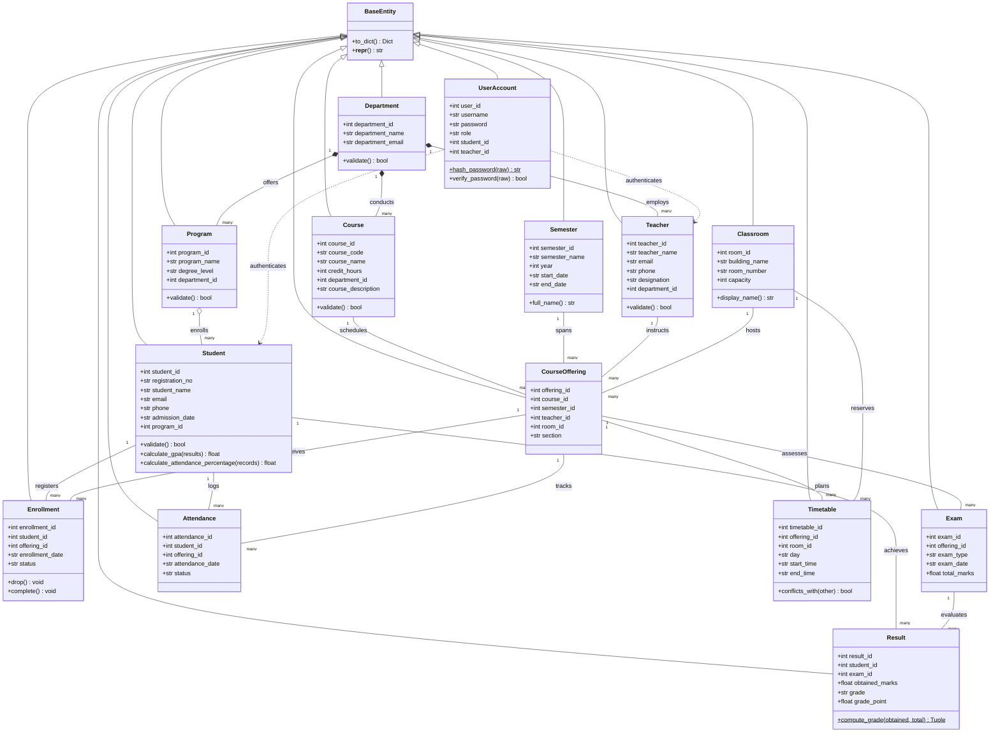

# University Management System (UMS) - UML Class Diagram

## SDAA Architecture & Object-Oriented Domain Model
- **Group Members:** Syed Ali Zaman, Muhammad Yasir Ali, Muhammad Umer

```mermaid
classDiagram
    class BaseEntity {
        +to_dict() Dict
        +__repr__() str
    }

    class Department {
        +int department_id
        +str department_name
        +str department_email
        +validate() bool
    }

    class Program {
        +int program_id
        +str program_name
        +str degree_level
        +int department_id
        +validate() bool
    }

    class Student {
        +int student_id
        +str registration_no
        +str student_name
        +str email
        +str phone
        +str admission_date
        +int program_id
        +validate() bool
        +calculate_gpa(results) float
        +calculate_attendance_percentage(records) float
    }

    class Teacher {
        +int teacher_id
        +str teacher_name
        +str email
        +str phone
        +str designation
        +int department_id
        +validate() bool
    }

    class Course {
        +int course_id
        +str course_code
        +str course_name
        +int credit_hours
        +int department_id
        +str course_description
        +validate() bool
    }

    class Semester {
        +int semester_id
        +str semester_name
        +int year
        +str start_date
        +str end_date
        +full_name() str
    }

    class Classroom {
        +int room_id
        +str building_name
        +str room_number
        +int capacity
        +display_name() str
    }

    class CourseOffering {
        +int offering_id
        +int course_id
        +int semester_id
        +int teacher_id
        +int room_id
        +str section
    }

    class Enrollment {
        +int enrollment_id
        +int student_id
        +int offering_id
        +str enrollment_date
        +str status
        +drop() void
        +complete() void
    }

    class Exam {
        +int exam_id
        +int offering_id
        +str exam_type
        +str exam_date
        +float total_marks
    }

    class Result {
        +int result_id
        +int student_id
        +int exam_id
        +float obtained_marks
        +str grade
        +float grade_point
        +compute_grade(obtained, total)$ Tuple
    }

    class Attendance {
        +int attendance_id
        +int student_id
        +int offering_id
        +str attendance_date
        +str status
    }

    class Timetable {
        +int timetable_id
        +int offering_id
        +int room_id
        +str day
        +str start_time
        +str end_time
        +conflicts_with(other) bool
    }

    class UserAccount {
        +int user_id
        +str username
        +str password
        +str role
        +int student_id
        +int teacher_id
        +hash_password(raw)$ str
        +verify_password(raw) bool
    }

    BaseEntity <|-- Department
    BaseEntity <|-- Program
    BaseEntity <|-- Student
    BaseEntity <|-- Teacher
    BaseEntity <|-- Course
    BaseEntity <|-- Semester
    BaseEntity <|-- Classroom
    BaseEntity <|-- CourseOffering
    BaseEntity <|-- Enrollment
    BaseEntity <|-- Exam
    BaseEntity <|-- Result
    BaseEntity <|-- Attendance
    BaseEntity <|-- Timetable
    BaseEntity <|-- UserAccount

    Department "1" *-- "many" Program : offers
    Department "1" *-- "many" Teacher : employs
    Department "1" *-- "many" Course : conducts
    Program "1" o-- "many" Student : enrolls
    Course "1" -- "many" CourseOffering : schedules
    Semester "1" -- "many" CourseOffering : spans
    Teacher "1" -- "many" CourseOffering : instructs
    Classroom "1" -- "many" CourseOffering : hosts
    Student "1" -- "many" Enrollment : registers
    CourseOffering "1" -- "many" Enrollment : receives
    CourseOffering "1" -- "many" Exam : assesses
    Student "1" -- "many" Result : achieves
    Exam "1" -- "many" Result : evaluates
    Student "1" -- "many" Attendance : logs
    CourseOffering "1" -- "many" Attendance : tracks
    CourseOffering "1" -- "many" Timetable : plans
    Classroom "1" -- "many" Timetable : reserves
    UserAccount ..> Student : authenticates
    UserAccount ..> Teacher : authenticates
```
