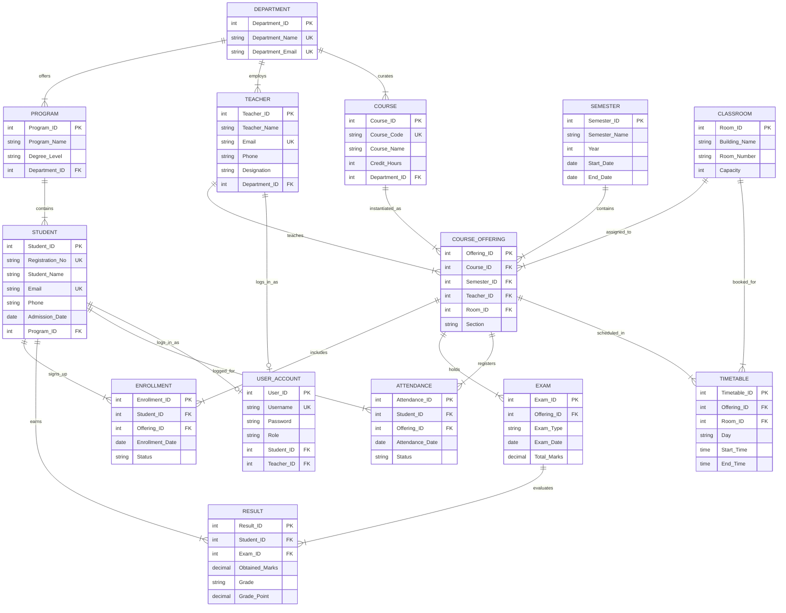

# University Management System (UMS) - Entity Relationship Diagram (ERD)

## SDAA Project Specification
- **Group Members:** Syed Ali Zaman, Muhammad Yasir Ali, Muhammad Umer
- **Total Entities:** 14 (Exceeds required minimum of 10)
- **Design:** Third Normal Form (3NF)

